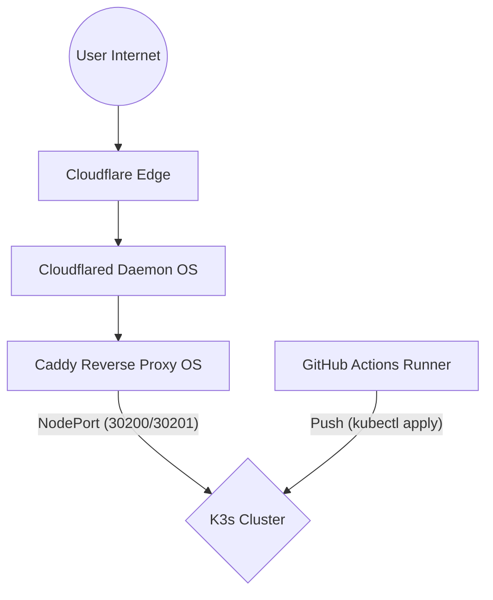
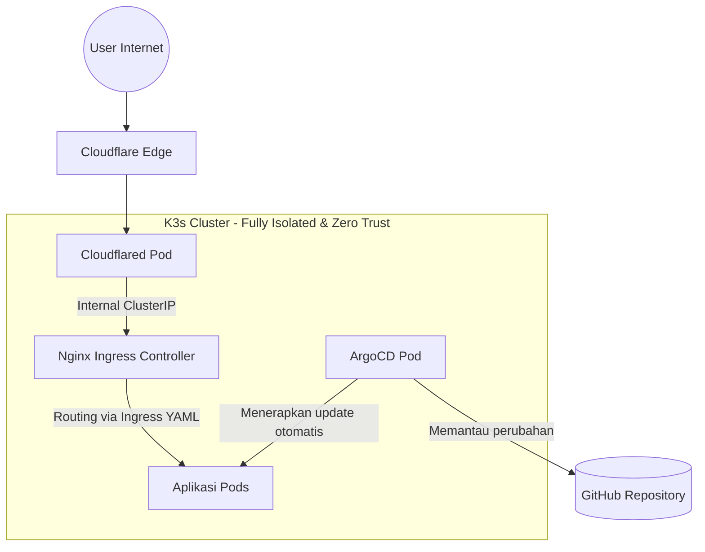

# Masterplan Infrastruktur: Dari Homelab ke Level Industri (Enterprise)

Dokumen ini adalah panduan lengkap untuk memahami apa yang sebenarnya berjalan di dalam servermu saat ini, serta cetak biru (*blueprint*) untuk merombaknya menjadi arsitektur DevOps kelas dunia.

---

## BAGIAN 1: Membedah Servermu Saat Ini (Analogi Kota Modern)

Untuk memudahkan pemahaman yang sangat teknis ini, mari kita bayangkan server Ubuntu-mu (`voxden`) sebagai **sebidang tanah yang luas**. Di atas tanah tersebut, kamu membangun sebuah kota modern yang tertutup tembok tinggi.

### 1. K3s (Kubernetes) = "Pemerintah Kota"
K3s adalah versi ringan dari Kubernetes. Alih-alih kamu harus menyalakan aplikasi satu per satu memakai perintah `docker run` (seperti mengelola rumah tanpa aturan), K3s bertindak sebagai pemerintah kota. 
Jika ada aplikasi (rumah) yang runtuh/*crash*, K3s akan otomatis membangunnya kembali dalam hitungan detik. K3s juga yang mengatur jalan raya (jaringan) agar aplikasi bisa saling mengobrol.

### 2. Pods = "Gedung-Gedung di Dalam Kota"
Di dalam K3s, kodemu dibungkus menjadi sebuah **Pod** (berisi *container*). Dari data yang kita tarik sebelumnya, kamu memiliki gedung-gedung ini:
* **Gedung Aplikasi:** `my-website-frontend`, `my-website-backend`, `my-website-postgres`, `my-website-redis`.
* **Gedung Pemantauan (Observability):** 
  * `Prometheus`: CCTV kota yang memantau penggunaan RAM/CPU.
  * `Loki`: Perpustakaan yang mengumpulkan semua teks *log* (`console.log`, pesan *error*) dari seluruh gedung.
  * `Grafana`: Layar monitor raksasa tempat kamu melihat data CCTV (Prometheus) dan log (Loki) dalam bentuk grafik visual yang cantik.

### 3. Services (ClusterIP vs NodePort) = "Jalan Raya & Gerbang Tol"
* **ClusterIP:** Ini adalah jalan internal kota. Contohnya, `my-website-backend` butuh ke *database*. Mereka mengobrol lewat jalan ClusterIP. Orang dari luar kota **tidak bisa** melewati jalan ini.
* **NodePort:** Ini adalah **Gerbang Tol** yang melubangi tembok kota. Kamu melubangi tembok di port `30200` agar orang di luar tembok (sistem operasi Ubuntu) bisa memanggil `my-website-backend`.

### 4. Caddy & Cloudflared = "Resepsionis di Luar Kota"
Saat ini, **Cloudflared** dan **Caddy** berada di sistem operasi Ubuntu (di luar kota K3s).
Alurnya:
1. Orang dari internet datang lewat terowongan **Cloudflared**.
2. **Caddy** menyambut mereka. Caddy melihat tiket pengunjung ("Oh, kamu mau ke `api.nabilbuilds.my.id`?").
3. Caddy menggiring pengunjung itu menuju **Gerbang Tol (NodePort 30200)** untuk masuk ke dalam kota K3s dan menemui Pod *Backend*.

### 5. Diagram Arsitektur Saat Ini (Tradisional)
Berikut adalah gambaran visual dari penjelasan di atas:

---

## BAGIAN 2: Masalah di Arsitektur Saat Ini

Meskipun sistem di atas sudah berjalan sangat baik, di level "Enterprise", memiliki **Gerbang Tol (NodePort)** dan **Resepsionis di luar tembok (Caddy di Ubuntu)** dianggap sebagai titik lemah keamanan dan sulit di-skala (*scaling*).

Kenapa?
* Caddy harus di-edit manual (`nano Caddyfile`) setiap kali kamu menambah aplikasi baru.
* Kamu masih mem-*deploy* aplikasi dengan GitHub Actions yang memaksa masuk ke server secara remote (Push). Jika kredensial GitHub bocor, *hacker* bisa merusak servermu.

---

## BAGIAN 3: Solusi Arsitektur Enterprise (GitOps & In-Cluster Ingress)

Kita akan memindahkan semua resepsionis ke **dalam** kota, dan menutup semua Gerbang Tol (NodePort) selamanya. Kota K3s-mu akan menjadi 100% mandiri dan kedap udara.

### Penjelasan Tools Baru yang Akan Dipakai:

| Nama Tool | Analogi & Penjelasan Teknis | Mengapa Kita Butuh Ini? |
|---|---|---|
| **Helm** | **"Kontraktor Bangunan"** Adalah *package manager* (seperti `apt` untuk K8s). | Daripada kamu mengetik manifes YAML ribuan baris untuk menginstal sistem yang rumit, Helm memungkinkan kita menginstal aplikasi kompleks (seperti ArgoCD) hanya dengan 1 baris perintah. |
| **Nginx Ingress** | **"Resepsionis Baru di Dalam Kota"** Pengganti Caddy. Ingress ini akan hidup di dalam K3s. | Menggunakan standar Kubernetes (`Ingress.yaml`). Setiap kali kamu menambah *website* baru, kamu cukup menambahkan 1 file YAML, lalu Nginx akan otomatis memetakan trafiknya ke Pod tujuan via jalan internal (ClusterIP). |
| **Cloudflared (Pod)** | **"Terowongan Bawah Tanah"** Memindahkan `cloudflared` dari Ubuntu OS menjadi Pod di K3s. | Pod Cloudflared ini akan terhubung langsung ke Nginx Ingress. **Hasilnya:** Trafik internet masuk langsung dari Cloudflare ke Nginx tanpa pernah menyentuh port Ubuntu-mu. Server Ubuntu 100% terkunci rapat dari internet. |
| **ArgoCD (GitOps)** | **"Robot Mandor"** Pengganti GitHub Runner. | ArgoCD adalah robot di dalam K3s yang terus-menerus menatap layar GitHub-mu. Jika kamu mengubah kode di GitHub, **ArgoCD yang akan merakit dan menerapkan kode itu dari dalam**. GitHub tidak perlu punya akses ke servermu sama sekali. (Prinsip PULL, bukan PUSH). |

### Diagram Arsitektur Target (Level Industri / GitOps)

---

## BAGIAN 4: Alur Deployment (Setelah Pakai ArgoCD)

1. Kamu mengubah *codingan* aplikasi Kost di komputermu.
2. Kamu melakukan `git push` ke GitHub.
3. GitHub Actions **hanya** bertugas membuat *image* Docker (GHCR).
4. GitHub Actions memperbarui tulisan *tag* versi di file manifes (misal: `image: repo:v2`).
5. **ArgoCD (di servermu) menyadari perubahan teks itu**.
6. ArgoCD men-download *image* `v2` secara diam-diam.
7. ArgoCD menghancurkan Pod Kost lama, dan membangun Pod Kost baru tanpa intervensi manual darimu. **Selesai!**

---

## BAGIAN 5: Roadmap Migrasi

Agar `my-website` yang saat ini sedang *live* tidak mati (*downtime*), kita akan memigrasi Kost Project secara paralel:

1. **Persiapan Dasar:** Memasang `Helm` di OS Ubuntu.
2. **Setup Ingress:** Menginstal `Nginx Ingress Controller` via Helm ke dalam K3s.
3. **Setup Tunnel K8s:** Menginstal `Cloudflared` sebagai Pod K3s yang merutekan internet langsung ke Nginx.
4. **Pembuatan Rute (YAML):** Menerjemahkan aturan Kost dari `Caddyfile` menjadi file `Ingress.yaml`.
5. **Instalasi ArgoCD:** Memasang robot GitOps untuk mengelola repo Kost Project.
6. **Eksekusi Akhir:** Mematikan Caddy OS dan Cloudflared OS lama.
